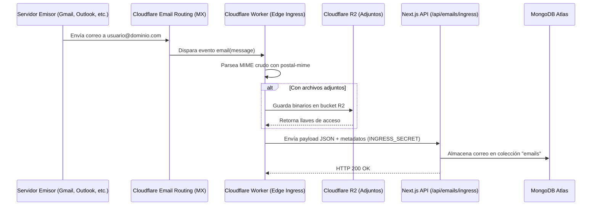

# 📬 Broslunas Correo (Webmail)

Cliente y servicio de correo electrónico moderno, privado y de alto rendimiento. Construido con **Next.js 16 (App Router)**, **Cloudflare Workers** para el enrutamiento y procesamiento en el Edge, **Cloudflare R2** para almacenamiento de adjuntos, y **MongoDB Atlas** para persistencia de datos.

---

## 🚀 Características Principales

### 📬 Gestión de Correo
- **Redactor enriquecido (WYSIWYG)** con guardado automático de borradores en tiempo real.
- **Adjuntos y Drive**: Carga mediante arrastrar y soltar, subida a Cloudflare R2 y selector integrado con Google Drive.
- **Visualizador y sanitizado**: Renderizado seguro de HTML con `DOMPurify` e `isomorphic-dompurify`.
- **Hilos y respuestas**: Agrupación inteligente de conversaciones, responder, responder a todos y reenvío.
- **Carpetas estándar**: Bandeja de entrada, Enviados, Borradores, Papelera, Spam y Archivo.
- **Filtros y búsqueda avanzada**: Filtrado por remitente, destinatario, etiquetas, adjuntos y palabras clave.

### 🔒 Seguridad y Autenticación
- **Múltiples métodos de acceso**:
  - Google OAuth 2.0.
  - Passkeys / WebAuthn FIDO2 (`@simplewebauthn`).
  - Autenticación en dos pasos (2FA / TOTP con código QR).
- **Lista negra**: Bloqueo de remitentes y dominios no deseados.
- **Acceso por invitación**: Enlaces de registro seguros gestionados por administradores.

### 🎨 Experiencia de Usuario (UI/UX)
- **Tema Claro / Oscuro nativo** con persistencia y detección de preferencias del sistema.
- **Atajos de teclado** estilo Gmail/Outlook para navegación, lectura y redacción rápida (`?` para ayuda).
- **Notificaciones Push Web**: Compatibilidad con Web Push API (VAPID) en navegadores compatibles.
- **Gestión de Contactos y Plantillas**: Libreta de direcciones integrada y respuestas rápidas.
- **Asistente IA**: Enrutador compatible con OpenAI para redacción y análisis de correos.

### 🛠️ Administración
- Panel administrativo para gestionar buzones, usuarios, invitaciones y almacenamiento.
- Métricas de uso y control de cuotas por dominio/usuario.

---

## 🏗️ Arquitectura del Sistema



- **Recepción**: Cloudflare Email Routing ➔ Cloudflare Worker ➔ Next.js Ingress API ➔ MongoDB.
- **Envío**: Next.js API ➔ Mailjet API v3.1.
- **Adjuntos**: Cloudflare R2 (compatible con API S3).

---

## 📦 Tecnologías Utilizadas

- **Framework**: [Next.js 16](https://nextjs.org/) (App Router, React 19)
- **Lenguaje**: TypeScript
- **Estilos**: Tailwind CSS, PostCSS
- **Animaciones e Interfaz**: Framer Motion, GSAP, Lucide Icons, Sonner
- **Base de Datos**: MongoDB Atlas (driver nativo `mongodb`)
- **Almacenamiento de Archivos**: Cloudflare R2 (`@aws-sdk/client-s3`)
- **Procesamiento MIME**: `postal-mime`
- **Envío de Correos**: Mailjet API (`mailjet.ts`)
- **Autenticación**: JWT (`jose`), `@simplewebauthn`, TOTP (`qrcode`)
- **Notificaciones**: `web-push`

---

## ⚙️ Configuración y Variables de Entorno

Crea un archivo `.env.local` a partir de `.env.local.example`:

```bash
cp .env.local.example .env.local
```

Configura las siguientes variables en `.env.local`:

```ini
# Base de datos (MongoDB Atlas)
MONGODB_URI=mongodb+srv://<user>:<password>@cluster0.xxxxx.mongodb.net/?retryWrites=true&w=majority
MONGODB_DB=mailservice

# Autenticación y Sesión
JWT_SECRET=tu_secreto_jwt_generado_con_openssl
GOOGLE_CLIENT_ID=tu_google_client_id
GOOGLE_CLIENT_SECRET=tu_google_client_secret
ALLOWED_USER_EMAIL=tu_correo@gmail.com
NEXT_PUBLIC_APP_URL=http://localhost:3000

# Google Drive Picker (Opcional para adjuntos de Drive)
NEXT_PUBLIC_GOOGLE_CLIENT_ID=tu_google_client_id
NEXT_PUBLIC_GOOGLE_DEVELOPER_KEY=tu_google_api_key

# Envío de correo (Mailjet)
MAILJET_API_KEY=tu_mailjet_api_key
MAILJET_API_SECRET=tu_mailjet_api_secret
MAILJET_FROM_EMAIL=correo@tudominio.com
MAILJET_FROM_NAME="Tu Nombre"

# Almacenamiento Cloudflare R2
R2_ACCESS_KEY_ID=tu_r2_access_key
R2_SECRET_ACCESS_KEY=tu_r2_secret_key
R2_ENDPOINT=https://<account_id>.r2.cloudflarestorage.com
R2_BUCKET_NAME=webmail-attachments

# Webhook de recepción (Ingress)
INGRESS_SECRET=token_secreto_compartido_con_cloudflare_worker

# Web Push (VAPID)
NEXT_PUBLIC_VAPID_PUBLIC_KEY=tu_vapid_public_key
VAPID_PRIVATE_KEY=tu_vapid_private_key
VAPID_SUBJECT=mailto:tu_correo@tudominio.com

# Asistente IA (Opcional)
AI_ROUTER_API_KEY=tu_api_key
AI_ROUTER_ENDPOINT=https://ai.broslunas.com/v1
AI_MODEL=rotate-top
```

---

## 🛠️ Instalación y Ejecución Local

### Prerrequisitos
- Node.js 18.17+ o 20+
- Gestor de paquetes `npm`, `yarn` o `pnpm`
- Instancia activa de MongoDB

### Pasos

1. **Instalar dependencias:**
   ```bash
   npm install
   ```

2. **Ejecutar servidor de desarrollo:**
   ```bash
   npm run dev
   ```
   Abre [http://localhost:3000](http://localhost:3000) en el navegador.

3. **Construir para producción:**
   ```bash
   npm run build
   npm run start
   ```

---

## ⚡ Configuración de Recepción (Cloudflare Worker)

Para recibir correos dirigidos a tu dominio personalizado:

1. Revisa la guía detallada en [`cloudflare-worker/README.md`](cloudflare-worker/README.md).
2. Crea un Worker en Cloudflare e implementa el código de [`cloudflare-worker/worker.js`](cloudflare-worker/worker.js).
3. Vincula el bucket **R2** con la variable `BUCKET`.
4. Define las variables `WEBMAIL_DOMAIN` y `INGRESS_SECRET` en el Worker.
5. Habilita **Cloudflare Email Routing** y configura una regla que envíe los correos entrantes al Worker.

---

## ⌨️ Atajos de Teclado Principales

| Tecla | Acción |
| :--- | :--- |
| `C` | Redactar nuevo correo |
| `J` / `K` | Navegar correos (abajo / arriba) |
| `Enter` / `O` | Abrir correo seleccionado |
| `E` | Archivar correo |
| `#` / `Delete` | Mover a la papelera |
| `R` | Responder |
| `A` | Responder a todos |
| `F` | Reenviar |
| `/` | Enfocar buscador |
| `?` | Ver lista completa de atajos |

---

## 📄 Licencia

Uso privado y propietario bajo Broslunas.
