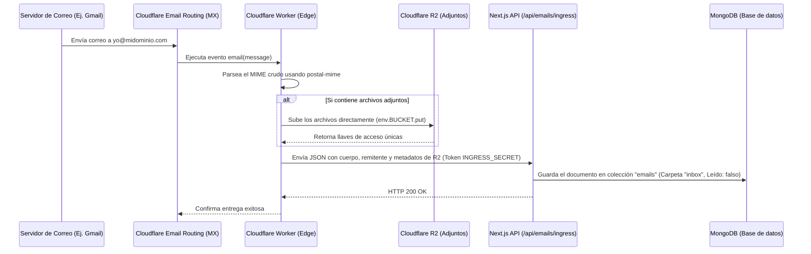

# Guía de Configuración del Cloudflare Worker para Recepción de Correos

Para recibir correos bajo tu propio dominio y que se guarden automáticamente en MongoDB y los archivos adjuntos se suban a tu bucket de Cloudflare R2, debes configurar un **Cloudflare Worker** y vincularlo con **Cloudflare Email Routing**.

Sigue estos pasos detallados para realizar la configuración:

---

## Paso 1: Crear el Worker en Cloudflare

1. Inicia sesión en tu panel de control de **Cloudflare**.
2. Dirígete a **Workers & Pages** -> **Create Application** -> **Create Worker**.
3. Nombra tu Worker (por ejemplo, `webmail-ingress-worker`).
4. Haz clic en **Deploy**.
5. Tras el despliegue inicial, haz clic en **Edit Code** para abrir el editor web.

---

## Paso 2: Configurar las Dependencias del Worker

El script del Worker utiliza `postal-mime` para analizar el contenido del correo y extraer los adjuntos directamente en el borde (Edge).

Si editas el código localmente utilizando Wrangler o la consola, asegúrate de añadir la dependencia:
```json
{
  "dependencies": {
    "postal-mime": "^2.0.0"
  }
}
```
*Si utilizas el editor web de Cloudflare:* puedes instalar paquetes directamente importándolos como módulos ES estándar (la plataforma resuelve de manera automática `import PostalMime from 'postal-mime'`).

Copia el contenido del archivo [`worker.js`](file:///C:/Users/pablo/Workspace/full-mail-service/webmail-frontend/cloudflare-worker/worker.js) y pégalo en el editor `index.js` del Worker. Haz clic en **Save and Deploy**.

---

## Paso 3: Configurar Variables de Entorno y Enlaces (R2)

Para que el Worker funcione correctamente, necesita acceso a las variables y al bucket R2. En el panel de control de Cloudflare:

1. Ve a la pestaña **Settings** (Configuración) de tu Worker recién creado.
2. Selecciona **Variables**.
3. En la sección **Environment Variables**, añade las siguientes variables:
   - **`WEBMAIL_DOMAIN`**: El dominio de producción donde está alojado tu sitio web de Next.js (por ejemplo, `tu-webmail.vercel.app` o `mail.tudominio.com`). **No** incluyas `https://` ni barras diagonales `/`.
   - **`INGRESS_SECRET`**: Un token secreto y seguro de autorización. Debe coincidir **exactamente** con la variable `INGRESS_SECRET` que configuraste en el archivo `.env.local` de Next.js.
4. En la sección **R2 Bucket Bindings** (Enlaces de R2):
   - Haz clic en **Add Binding**.
   - **Variable name**: Escribe exactamente **`BUCKET`** (en mayúsculas).
   - **R2 Bucket**: Selecciona tu bucket de Cloudflare R2 destinado a los archivos adjuntos (el mismo que configuraste en `R2_BUCKET_NAME` en tu aplicación Next.js).
5. Guarda los cambios.

---

## Paso 4: Vincular con Cloudflare Email Routing

Una vez configurado y desplegado el Worker:

1. Ve a la página de inicio de tu cuenta de Cloudflare y selecciona el **dominio bajo el cual deseas recibir correos**.
2. En el menú de la izquierda, haz clic en **Email** -> **Email Routing**.
3. Si no lo has hecho, habilita el servicio (Cloudflare te guiará para configurar los registros MX necesarios en tus DNS de forma automática con un solo clic).
4. Dirígete a la pestaña **Routing Rules** (Reglas de enrutamiento).
5. Haz clic en **Create Rule** (Crear regla):
   - **Rule Name**: Ingress Webmail.
   - **Custom Address**: Define la dirección de correo que quieras usar (ej. `yo@midominio.com`) o selecciona *Catch-all* para recibir todos los correos enviados a cualquier dirección bajo tu dominio.
   - **Action**: Selecciona **Send to Worker**.
   - **Destination**: Selecciona tu Worker (`webmail-ingress-worker`).
6. Guarda la regla.

---

## ¿Cómo funciona el flujo de recepción?



---

## Pruebas de Funcionamiento

Una vez configurado, puedes enviar un correo desde cualquier cuenta externa (como Gmail u Outlook) a la dirección que configuraste. 

El correo debería aparecer en tu bandeja de entrada en Next.js en cuestión de segundos. Si hay archivos adjuntos, se guardarán en R2 y podrás descargarlos de forma segura desde la interfaz del Dashboard.

Para revisar registros o errores de entrega:
- Ve al panel de Cloudflare -> **Workers & Pages** -> selecciona tu Worker -> haz clic en **Logs** -> **Start Debugging** para ver logs en tiempo real mientras realizas un envío de prueba.
